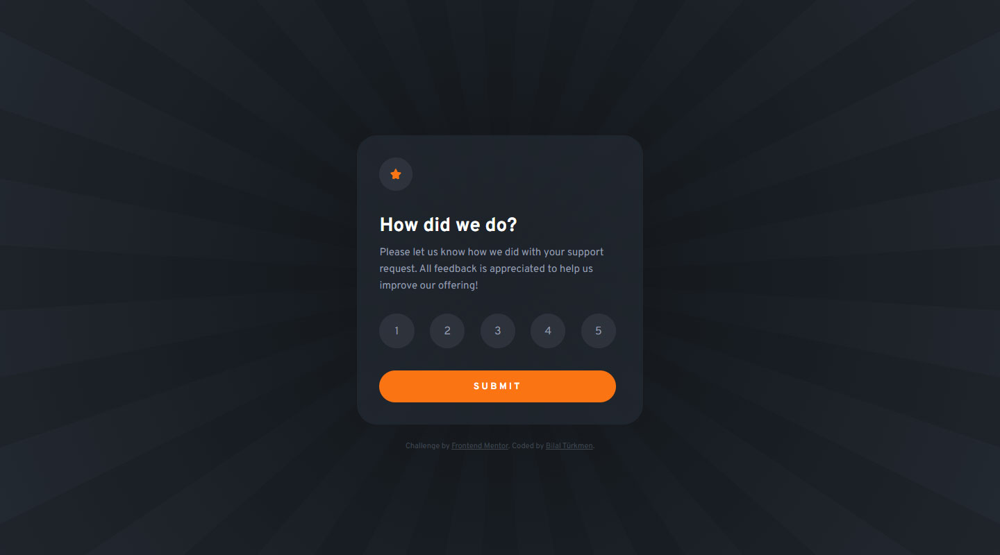

<h1>Interactive rating component</h1>

  <h3>
    <a href="https://playful-blini-96302b.netlify.app/"> Live View </a>
     | 
    <a href="https://www.frontendmentor.io/solutions/interactive-rating-comp-reacttypescript-tpior-NEqq"> Solution Page </a>
  </h3>

  A challenge on Frontend Mentor.

## 👍 My Challenges:

- i used typescript for development. it was pretty challenging.
- implement warning message when no voting. and add some nice effects.
- And also trying to presenting a good page experience.
- See hover states for all interactive elements on the page.

## 🎉 Build With:

- React+TypeScript and Vite builder
- Semantic HTML5 markup
- Css Flexbox
- Mobile-first workflow
- CSS custom properties
