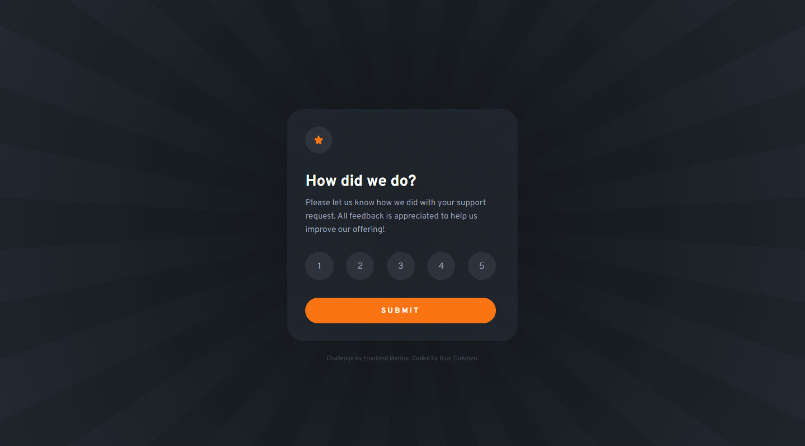

<h1>Interactive rating component</h1>

  <h3>
    <a href="https://playful-blini-96302b.netlify.app/"> Live View </a>
     | 
    <a href="https://www.frontendmentor.io/solutions/interactive-rating-comp-reacttypescript-tpior-NEqq"> Solution Page </a>
  </h3>

  A challenge on Frontend Mentor.

## 👍 My Challenges:

- i tried TypeScript for this solution. it was pretty challenging for me 👊
- implement warning message when no voting.
- Small effects have been added to improve the page experience.
- Some animations have been added to the interactive elements.

## 🎉 Build With:

- React JS + TypeScript
- Semantic HTML markup
- Flexbox CSS
- Mobile-first workflow
- CSS custom properties
